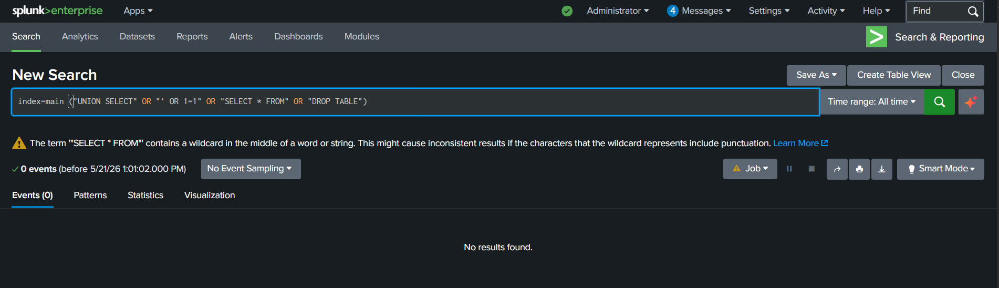
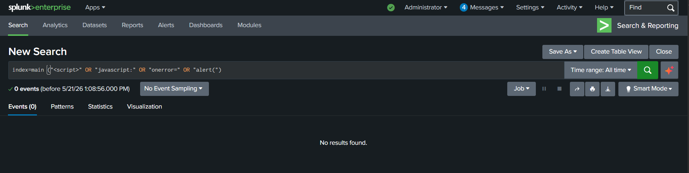
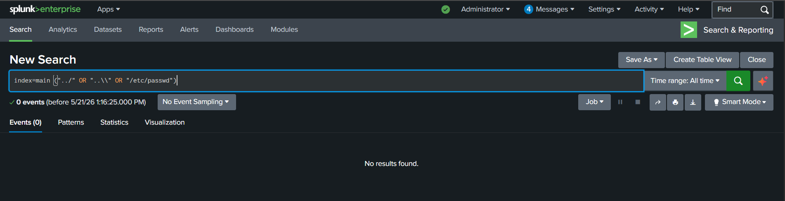
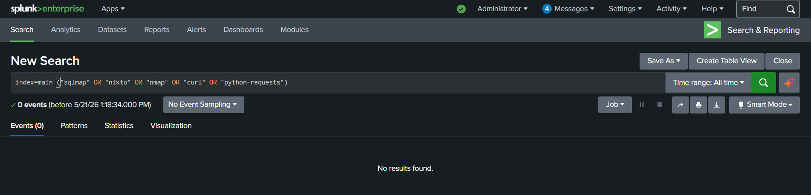
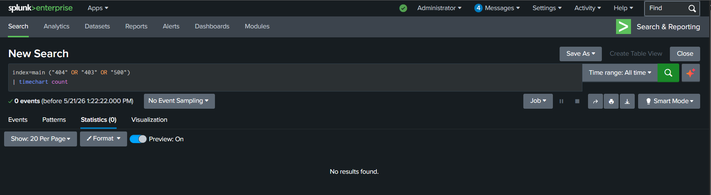
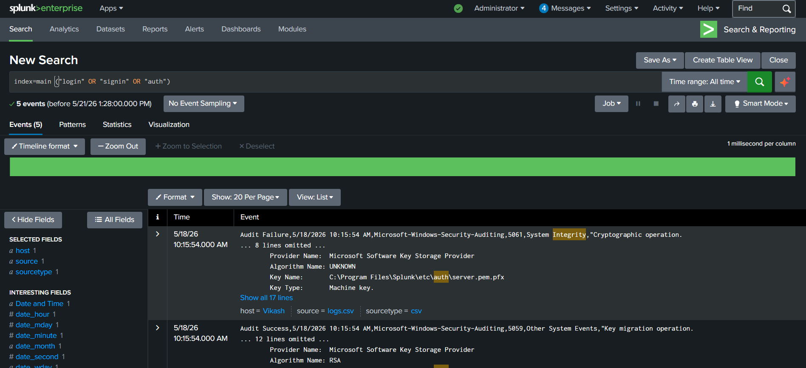

# Web Attack Monitoring Project

## Overview

- This project demonstrates a SOC detection engineering workflow focused on monitoring and investigating suspicious web activity using:

  - Splunk SIEM
  - Web server log analysis
  - Sigma rules
  - MITRE ATT&CK mapping
  - Threat hunting techniques
  - HTTP attack detection

- The project simulates how SOC analysts and detection engineers investigate suspicious web activity and identify common web attack patterns.

---

## Objectives

### Primary Goal

- Detect and investigate:

  - SQL Injection attempts
  - Cross-Site Scripting (XSS)
  - Directory traversal attempts
  - Web brute force attacks
  - Suspicious User-Agent activity
  - HTTP error spikes
  - Reconnaissance and scanning activity

---

## Technologies Used

| Technology | Purpose |
|---|---|
| Splunk Free | SIEM platform |
| Web Server Logs | HTTP telemetry |
| SPL | Detection queries |
| Sigma | Portable detections |
| MITRE ATT&CK | Threat mapping |

---

## MITRE ATT&CK Mapping

| Technique | ID | Tactic |
|---|---|---|
| Exploit Public-Facing Application | T1190 | Initial Access |
| Brute Force | T1110 | Credential Access |
| Command and Scripting Interpreter | T1059 | Execution |
| Active Scanning | T1595 | Reconnaissance |

---

## Web Attack Indicators

- This project monitors for:

  - Suspicious URL patterns
  - SQL Injection keywords
  - XSS payload indicators
  - Excessive failed requests
  - Directory traversal attempts
  - Malicious User-Agents
  - Authentication abuse
  - HTTP error anomalies

---

## Example Splunk Detection Query

```spl
index=main ("UNION SELECT" OR "SELECT * FROM" OR "' OR 1=1")
````

---

## Detection Engineering Concepts

- This project explores:

  * Web attack detection
  * HTTP telemetry analysis
  * Threat hunting workflows
  * Detection logic development
  * Log analysis
  * Security investigation methodology

---

## Example Sigma Detection

```yaml id="m4tx9h"
title: SQL Injection Attempt Detection

description: Detects potential SQL Injection activity in web logs.

logsource:
  category: webserver

detection:
  selection:
    cs-uri-query|contains:
      - "UNION SELECT"
      - "' OR 1=1"
      - "SELECT * FROM"

  condition: selection

level: high
```

---

## Investigation Workflow

1. Review suspicious HTTP requests
2. Identify malicious patterns
3. Analyze source behavior
4. Investigate targeted endpoints
5. Correlate attack indicators
6. Escalate suspicious activity

---

## False Positives

- Potential benign causes:

  * Security testing
  * Vulnerability scanners
  * Developer testing
  * Encoded URLs
  * Search engine crawlers

---

## SOC Skills Demonstrated

* Splunk web log analysis
* Threat hunting
* Detection engineering
* HTTP telemetry analysis
* Sigma rule creation
* ATT&CK mapping
* Web attack monitoring
* Security investigation workflows

---

## Future Improvements

- Potential future enhancements:

  * GeoIP correlation
  * Threat intelligence integration
  * Automated alerting
  * Web attack dashboards
  * IP reputation analysis
  * WAF telemetry integration

---

## Project Status

- Active SOC detection engineering learning project focused on web attack monitoring and suspicious HTTP activity detection.

---

## Screenshots

### SQL Injection Detection



---

### XSS Detection



---

### Directory Traversal Detection



---

### Suspicious User-Agent Hunting



---

### HTTP Error Monitoring



---

### Authentication Monitoring


